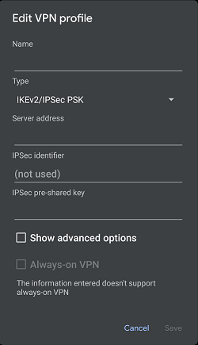
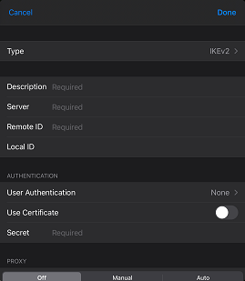

# Google Cloud Platform free tier IKEv2/IPSec PSK VPN Server

How to create a personal VPN Server on [Google Cloud Platform (GCP)](https://cloud.google.com/free) with [libreswan](https://libreswan.org/wiki/VPN_server_for_remote_clients_using_IKEv2) using the free tier Compute Engine.

Both [Android 11 or higher](https://source.android.com/devices/architecture/modular-system/ipsec) and [iOS 4.0+](https://developer.apple.com/documentation/devicemanagement/vpn/ikev2) devices can connect to IKEv2/IPSec VPN servers with their native VPN clients.

## PowerShell installation

Follow the instructions at <https://docs.microsoft.com/powershell/scripting/install/installing-powershell> to install PowerShell.

## gcloud command-line tool installation

Follow the instructions at <https://cloud.google.com/sdk/docs/install> to install the gcloud CLI, then run the following commands to initialize it and install the required components.

```powershell
gcloud init
gcloud components install beta
```

## Terraform installation

Follow the instructions at <https://learn.hashicorp.com/tutorials/terraform/install-cli?in=terraform/gcp-get-started> to install Terraform.

## Project billing and service configuration

Before creating your first VM instance, you need to link a billing account to the GCP project you will use to host your VPN server and enable the `compute.googleapis.com` service.

A default project and billing account are provisioned when you create a free trial GCP account.

Use the following PowerShell commands to get your default project and billing account details, and link them. Replace the `filter` parameters with the names of your project and billing account.

```powershell
gcloud projects list
$projectID = gcloud projects list `
    --filter="name:'My First Project'" `
    --format="value(projectId)"

gcloud beta billing accounts list
$billingAccount = gcloud beta billing accounts list `
    --filter="displayName:'My Billing Account'" `
    --format="value(name)"

gcloud beta billing projects link $projectID `
    --billing-account=$billingAccount

gcloud config set project $projectID
gcloud services enable compute.googleapis.com
```

## Dynamic DNS

GCP doesn't have a feature to create a public DNS name for virtual machines and [Google Cloud Free Tier does not include external IP addresses](https://cloud.google.com/free/docs/gcp-free-tier#free-tier-usage-limits). We will use a Dynamic DNS name to provide a convenient way to access the VPN server.

There are a few free Dynamic DNS service providers available, such as [No-IP.com](https://www.noip.com/remote-access). If you own a domain name, it is possible that your registrar provides this service (for example, [Google Domains](https://support.google.com/domains/answer/6147083).)

The installation script configures the [DDclient](https://ddclient.net/) package to update the dynamic DNS entry using the [dyndns2 protocol](https://ddclient.net/protocols.html#dyndns2). If you select a provider that doesn't support this protocol, you will need to adapt the startup script (`install.sh`).

## VM creation

The VM will be created and configured by [Terraform](https://www.terraform.io/). The `main.tf` configuration file requires the following parameters:

- `project`: Google Cloud Platform project ID
- `zone`: free VMs are available in the following zones:
  - `us-west1-a`
  - `us-west1-b`
  - `us-west1-c`
  - `us-central1-a`
  - `us-central1-b`
  - `us-central1-c`
  - `us-central1-f`
  - `us-east1-b`
  - `us-east1-c`
  - `us-east1-d`
- `instance_name`: Compute Engine VM instance name
- `ipsec_identifier`: IPSec identifier
- `hostname`: Dynamic DNS hostname
- `dyndns.server`: Dynamic DNS update server
  - No-IP.com: `dynupdate.no-ip.com`
  - Google Domains: `domains.google.com`
- `dyndns.user`: Dynamic DNS service user name
- `dyndns.password`: Dynamic DNS service password

Create a file with name `terraform.tfvars` with those parameters using the following format:

```ini
project          = "<GCP project ID>"
zone             = "<GCP zone>"
instance_name    = "<Compute Engine VM instance name>"
ipsec_identifier = "<IPSec Identifier>"
hostname         = "<hostname>"
dyndns           = {
    server   = "<Dynamic DNS update server>"
    user     = "<Dynamic DNS user name>"
    password = "<Dynamic DNS password>"
}
```

Execute the following commands to create the VPN server:

```powershell
gcloud auth application-default login
terraform init
terraform plan
terraform apply
```

Terraform will output the information required to configure the VPN client.

## SSH

Execute the following command to open an SSH session to your VM and check if the installation succeeded. Use the instructions at <https://cloud.google.com/compute/docs/startupscript#viewing_startup_script_logs> to view the installation script output.

```powershell
gcloud compute ssh <instance name> --zone=<zone>
```

## VPN client configuration

Terraform will output the required information to configure the VPN client. If necessary, use the following commands to recover it.

```powershell
# server_address
gcloud compute instances describe <instance name> `
    --zone <instance zone> `
    --flatten="metadata[dyndnshostname]"

# ipsec_identifier
gcloud compute instances describe <instance name> `
    --zone <instance zone> `
    --flatten="metadata[ipsecidentifier]"

# ipsec_pre_shared_key
gcloud compute instances describe <instance name> `
    --zone <instance zone> `
    --flatten="metadata[psk]"
```

### Android 11 native IKEv2/IPSec PSK VPN client configuration

Use the following values to configure the Android VPN client:

- Type: IKEv2/IPSec PSK
- Server address: `server_address`
- IPSec identifier: `ipsec_identifier`
- IPSec pre-shared key: `ipsec_pre_shared_key`



### iOS native IKEv2 VPN client configuration

Use the following values to configure the iOS VPN client:

- Type: IKEv2
- Server: `server_address`
- Remote ID: `server_address`
- Local ID: `ipsec_identifier`
- User Authentication: None
- Use Certificate: off
- Secret: `ipsec_pre_shared_key`


